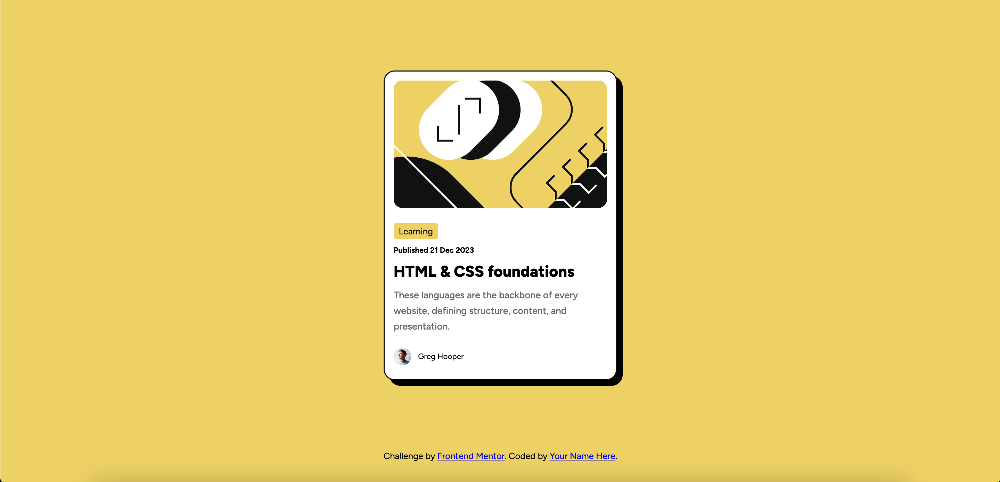

# Frontend Mentor - Blog preview card solution

This is a solution to the [Blog preview card challenge on Frontend Mentor](https://www.frontendmentor.io/challenges/blog-preview-card-ckPaj01IcS). Frontend Mentor challenges help you improve your coding skills by building realistic projects.

## Overview

### The challenge

Users should be able to:

- See hover and focus states for all interactive elements on the page

### Screenshot

- Solution URL: [Github](https://github.com/Kharmannn/frontendmentor_blog-preview-card/)
- Live Site URL: [Website](https://your-live-site-url.com)

### What I learned

- Wrapper is Key: The wrapper (parent container) is primarily responsible for the layout and positioning of its children using Flexbox properties.

- Children Styles: Apply additional styles to individual children when we need specific control over their appearance or spacing within the wrapper, but the overall positioning is typically managed by the wrapper.

- Consistency: This approach remains consistent whether we have 1 child or multiple children in the container.

- So, even with 3 children, we still apply Flexbox properties to the wrapper to control their overall alignment and positioning relative to each other. Then, we can apply additional styles directly to individual children if needed.

## Author

- Website - [Add your name here](https://www.your-site.com)
- Frontend Mentor - [@yourusername](https://www.frontendmentor.io/profile/yourusername)
- Twitter - [@yourusername](https://www.twitter.com/yourusername)
